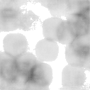

# VOCA
This repository provides implementation for the article *VOCA: cell nuclei detection in histopathology images by vector oriented confidence accumulation* by **Xie et al. 2019**.



## Guideline
`thyroid.py` is an example script for running the data processing, training, validation and cell nuclei dection on regions of interest (ROI) and whole slide images (WSI).

`VocaData` in `Dataset_classes.py` is an abstract class that handles all the processes in VOCA pipeline. 

Use the following command to run:

`python thyroid.py --stage $stage$`

`args.stage` specifies which stage of the pipeline the scipts should run: `'process'`, `'train'`, `'validation'`, `'roi_inference'`, `'ws_inference'`.

Please use `python thyroid.py --help` or check the code itself to see complete set of parameters and their descriptions.

## Optimization Target
The optimization target can be the binary cross entropy between the output maps and ground truth maps, or the batch wise F1 score. This can be specified by `args.metric` as `'acc'` or `'f1'`. Choosing F1 score as the objective will make the training much slower. 

## Python Dependencies
* torch 1.4.0
  * torchvision 0.5.0
* openslide 1.1.1
  * *Note: We recommend modifying openslide to correct for memory leak issue. Please see https://github.com/openslide/openslide-python/issues/24 for more information.*

## License
This project is under the CC-BY-NC 4.0 license. See [LICENSE](LICENSE.md) for details. (c) MSK

## Cite
If you find our work useful, please consider citing our [VOCA Paper](http://proceedings.mlr.press/v102/xie19a/xie19a.pdf):
```


@InProceedings{pmlr-v102-xie19a,
  title = 	 {VOCA: Cell Nuclei Detection In Histopathology Images By Vector Oriented Confidence Accumulation},
  author =       {Xie, Chensu and Vanderbilt, Chad M. and Grabenstetter, Anne and Fuchs, Thomas J.},
  booktitle = 	 {Proceedings of The 2nd International Conference on Medical Imaging with Deep Learning},
  pages = 	 {527--539},
  year = 	 {2019},
  editor = 	 {Cardoso, M. Jorge and Feragen, Aasa and Glocker, Ben and Konukoglu, Ender and Oguz, Ipek and Unal, Gozde and Vercauteren, Tom},
  volume = 	 {102},
  series = 	 {Proceedings of Machine Learning Research},
  month = 	 {08--10 Jul},
  publisher =    {PMLR},
  pdf = 	 {http://proceedings.mlr.press/v102/xie19a/xie19a.pdf},
  url = 	 {https://proceedings.mlr.press/v102/xie19a.html},
  abstract = 	 { Cell nuclei detection is the basis for many tasks in Computational Pathology ranging from cancer diagnosis to survival analysis. It is a challenging task due to the significant inter/intra-class variation of cellular morphology. The problem is aggravated by the need for additional accurate localization of the nuclei for downstream applications. Most of the existing methods regress the probability of each pixel being a nuclei centroid, while relying on post-processing to implicitly infer the rough location of nuclei centers. To solve this problem we propose a novel multi-task learning framework called vector oriented confidence accumulation (VOCA) based on deep convolutional encoder-decoder. The model learns a confidence score, localization vector and weight of contribution for each pixel. The three tasks are trained concurrently and the confidence of pixels are accumulated according to the localization vectors in detection stage to generate a sparse map that describes accurate and precise cell locations. A detailed comparison to the state-of-the-art based on a publicly available colorectal cancer dataset showed superior detection performance and significantly higher localization accuracy.}
}


```
